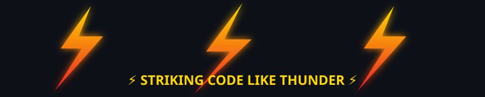

<!-- Animated wave banner, red -> blue -> gold -->

<!-- Animated typing intro -->

 

<!-- Social badges, red/blue/gold -->

<!-- ⚡ Animated lightning strip — upload lightning.svg to an /assets folder in this repo -->

---

### 🕸️ Cybersecurity Specialist

<!-- Spiderweb banner — upload spiderweb-banner.svg to the same /assets folder -->

---

### 💥 About This Hero

- 🔭 Always working on something new
- 🌱 Constantly learning and leveling up my skills
- ⚡ Superpower: turning coffee into commits
- 🎯 Mission: ship clean, reliable, well-tested code
- 🤝 Open to collaborating on interesting projects
- 📫 Reach me:mkhaleel0741@gmail.com
---

### 🛡️ Arsenal / Tech Stack

---

### ⚡ Battle Stats

---

### 💥 Featured Projects

<!-- GitHub can't play sound on click — this spark burst is the visual stand-in for that "repulsor" feel -->
<table align="center">
<tr>
<td align="center" width="300">
<a href="https://github.com/mkhaleelme/REPLACE-WITH-REPO-NAME">
 
<b>Project Name Here</b> 
One-line description of what it does
</a>
</td>
</tr>
</table>

---

### 📊 Mission Log (Activity Graph)

---

**"With great commits comes great deployments."** 💥

